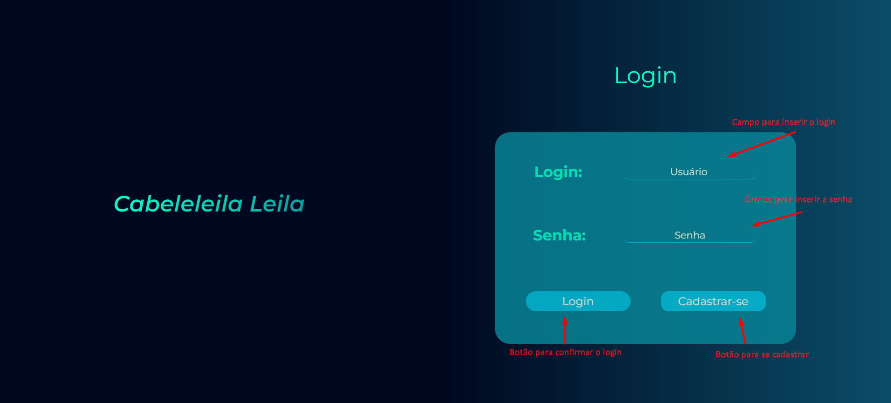
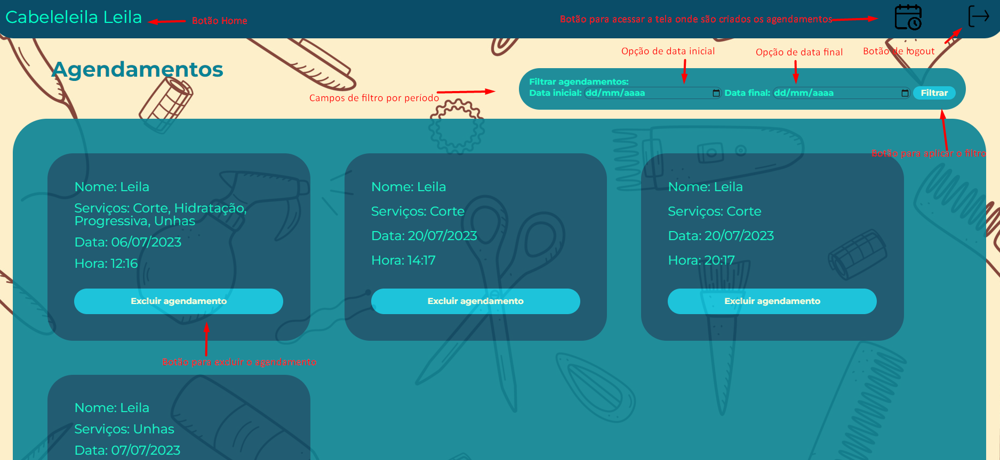
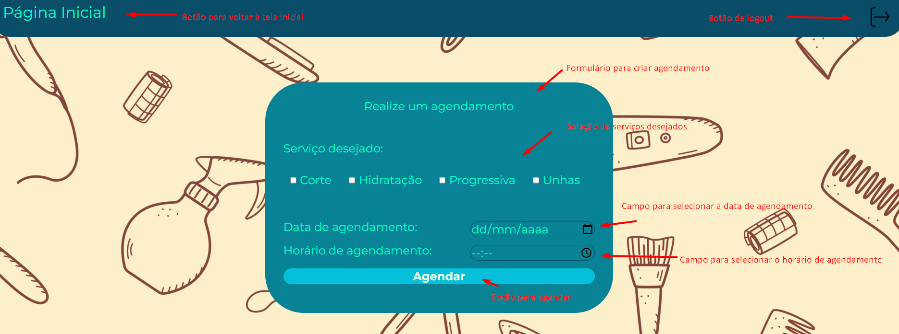

<h1 align="center">Projeto Cabeleleila Leila</h1>

Este projeto se trata de um teste prático da empresa Dsin para desenvolver um sistema que controle os agendamentos dos cliente do salão de beleza <strong>Cabeleleila Leila</strong>, cabelos, unhas, hidratação e unhas...

<h1 align="center">Documentação do Sistema "Cabeleleila Leila"</h1>
<h2>Introdução</h2>

  O "Cabeleleila Leila" é um sistema de agendamento de horários para um salão de beleza. Ele permite que os clientes realizem agendamentos de serviços, como hidratação, corte, progressiva e unhas, de forma conveniente. O sistema também oferece recursos de login, filtragem de agendamentos e exclusão de agendamentos para o usuário administrador. O sistema foi desenvolvido utilizando as tecnologias HTML5, CSS3, JavaScript e Node.js ()para executar o JsonServer e salvar os dados.

<h2>Tecnologias Utilizadas</h2>
<ol>
  <li>1. HTML5</li>
  <li>2. CSS3</li>
  <li>3. Java Script</li>
  <li>4. Node.js (versão 18.16.1)</li>
</ol>

<h2>Requisitos</h2>
  <ol>
    <li>Instalar na máquina o Node.js versão 18.16.1;
      <a href="https://nodejs.org/pt-br/download">https://nodejs.org/pt-br/download</a>
    </li>
    <li>Instalar a extensão LiveServer versão 5.7.9 (Recomendado utilizar a IDE Visual Studio Code);
      <a href="https://marketplace.visualstudio.com/items?itemName=ritwickdey.LiveServer">https://marketplace.visualstudio.com/items?itemName=ritwickdey.LiveServer</a>
    </li>
  </ol>

  <h1>Instalação e Configuração</h1>
  <ol>
    <li>Faça o download do código-fonte do sistema "Cabeleleila Leila" do repositório Git:
      <a href="https://github.com/MarcosGardinali/Cabeleleila_Leila">https://github.com/MarcosGardinali/Cabeleleila_Leila</a>
    </li>
    <li>Abra o terminal ou prompt de comando e navegue até o diretório raiz do projeto. Execute o seguinte comando para instalar as dependências do projeto:
      <code>npm install</code>
    </li>
    <li>Após a conclusão da instalação das dependências, execute o seguinte comando para iniciar o JsonServer e o sistema:
      <code>npx json-server --watch db.json</code>
    </li>
    <li>O sistema será iniciado e estará disponível no endereço:
      <a href="http://localhost:3000">http://localhost:3000</a>
    </li>
    <li>Necessário executar o projeto através do Live Server, clicando no botão Go Live no rodapé da IDE (caso seja o VSCode) estando com o código da página de login aberto.</li>
  </ol>

  <h2>Funcionalidades</h2>

  <h2>I. Tela de Login</h2>
  <ol>
    <li>Ao acessar o sistema, o usuário será direcionado para a tela de login;</li>
    <li>O usuário pode fazer login usando suas credenciais existentes ou cadastrar um novo login;</li>
    <li>Caso o login ou senha informados estiverem incorretos, o sistema irá alertar que os dados são inválidos e não deixará o usuário logar.</li>
  </ol>

  

  <h2>II. Listagem de Agendamentos</h2>
  <ol>
    <li>Após o login, o usuário poderá visualizar apenas os agendamentos vinculados ao seu usuário, sendo esta a página inicial do sistema;</li>
    <li>O usuário admin terá acesso a todos os agendamentos;</li>
    <li>A listagem funciona também como um histórico, visto que agendamentos retroativos também irão aparecer;</li>
    <li>Os agendamentos são carregados em ordem crescente de acordo com a data de agendamento.</li>
  </ol>

  

  <h2>III. Agendar Serviços</h2>
  <ol>
    <li>Ainda na tela de agendamentos, no canto superior direito, há um ícone de agenda. Ao clicar o usuário poderá agendar um serviço.</li>
    <li>O usuário poderá agendar um ou mais serviços entre os seguintes: Hidratação, Corte, Progressiva e Unhas;</li>
    <li>Para realizar o agendamento o usuário deverá selecionar a data, horário e serviço(s) desejados e clicar no botão “Agendar”. Sendo que nenhum dado poderá deixar de ser informado;</li>
    <li>Um mesmo horário não pode ser agendado mais de uma vez pelo mesmo usuário ou por outro usuário.</li>
  </ol>

  

  <h2>IV. Excluir Agendamentos</h2>
  <ol>
    <li>Em cada agendamento há disponível um botão de excluir para que o usuário possa excluir um agendamento se assim desejar.</li>
    <li>Para excluir um agendamento, o usuário deve clicar no botão “Excluir agendamento” respectivo ao agendamento que deseja excluir.</li>
  </ol>

  <h2>V. Filtrar Agendamentos por Data</h2>
  <ol>
    <li>O usuário poderá filtrar os agendamentos exibidos com base em uma data específica. O sistema exibirá apenas os agendamentos que correspondem à data selecionada;</li>
    <li>Logicamente, não é possível filtrar um agendamento com a data final maior que a data inicial e o sistema retorna que a data final deve ser maior que a inicial caso essa ação seja realizada.</li>
  </ol>

  <h2>VI. Administração</h2>
  <ol>
    <li>O usuário administrador terá permissão para excluir e visualizar qualquer agendamento existente, independentemente do usuário associado ao agendamento.</li>
  </ol>

  <h1>Conclusão</h1>
  
A documentação do sistema "Cabeleleila Leila" fornece uma visão geral das funcionalidades e requisitos do sistema. Siga as instruções de instalação e configuração para executar o sistema em sua máquina local. Aproveite os recursos de agendamento, filtragem e exclusão de agendamentos para melhorar a gestão de horários do salão de beleza.

<h2>Passo a passo para rodar o projeto</h2>

<ul>
  <li>Passo 1: Instale o node.js na sua máquina</li>
  <li>Passo 2: Abra o projeto no VSCode</li>
  <li>Passo 3: Abra o terminal do VSCode na raiz do projeto</li>
  <li>Passo 4: Insira no terminal o seguinte comando npm install</li>
  <li>Passo 5: Insira no terminal o seguinte comando: npx json-server --watch db.json</li>
  <li>Passo 6: Instale em seu VSCode a extensão "Live Server" que irá executar o projeto em tempo real enquanto o servidor está rodando</li>
  <li>Passo 7: Inicie o Live Server apertando o botão Go Live no canto inferior direito do VSCode estando com o código login.html aberto</li>
</ul>

<h2>Informações úteis</h2>
<ul>
<li>Para acessar com o usuário administrador e visualizar todos os agendamentos disponíveis, insira o login e senha: "admin" na tela de login</li>
<li>Para acessar o usuário Leila, insira o login: "Leila" e a senha: 123</li>
<li>Para acessar o usuário Maria, insira o login: "Maria" e a senha: 123</li>
<li>Se quiser criar um novo usuário, basta clicar no botão "Cadastrar-se" para ser redirecionado para a tela de cadastro de usuários</li>
</ul>
